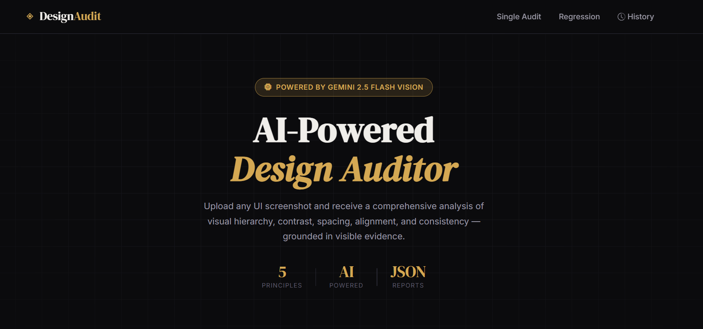
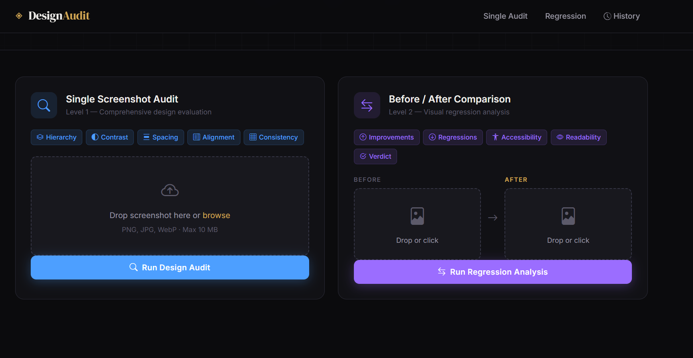
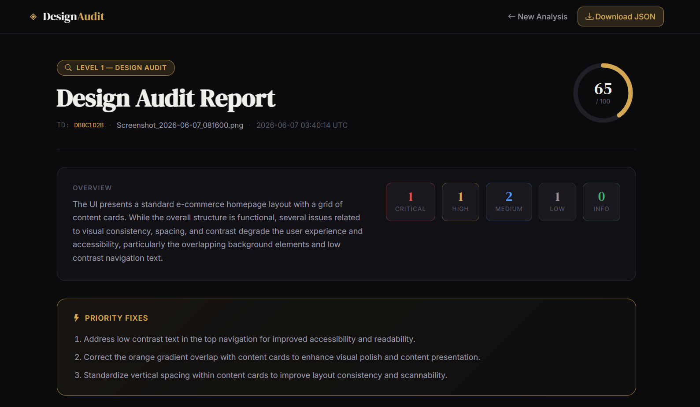
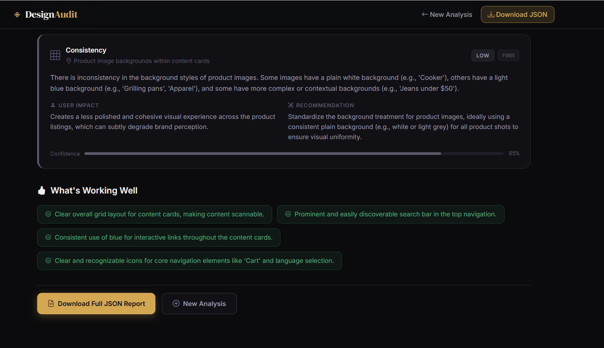
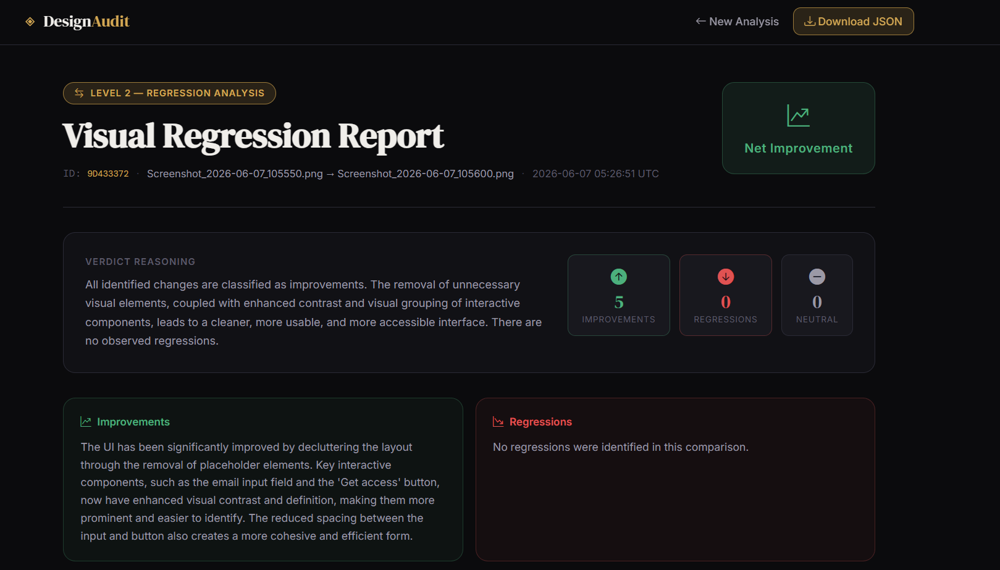
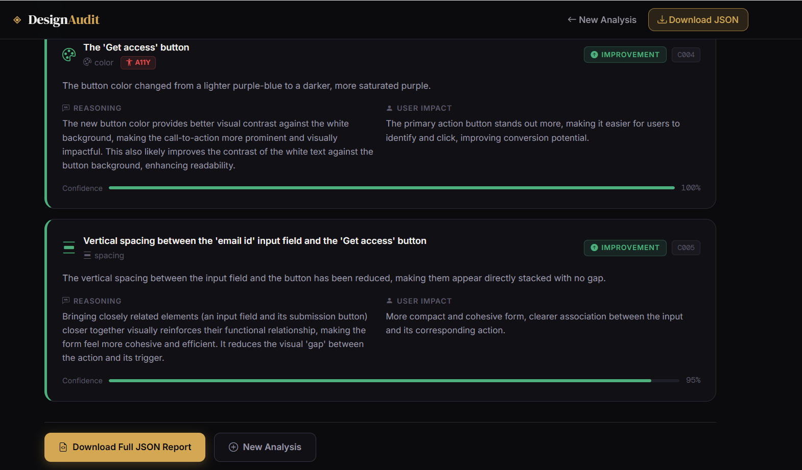

# ◈ Design Audit Agent

> **AI-powered UI design auditor built with Google Gemini 2.5 Flash Vision.**

Accepts screenshots and returns structured, evidence-grounded design evaluations — covering visual hierarchy, contrast, spacing, alignment, and consistency.

Supports both single-image audits (Level 1) and before/after regression analysis (Level 2).

---

## 🚀 Live Demo

**Try the deployed application:**

### 🌐 https://design-audit-agent.onrender.com/

Test both:
- Level 1 — Single Screenshot Design Audit
- Level 2 — Before/After Regression Analysis

---

## Features

|                                   |                                                                                                                                                          |
| --------------------------------- | -------------------------------------------------------------------------------------------------------------------------------------------------------- |
| **Level 1 — Design Audit**        | Uploads one screenshot → AI analyses it against 5 design principles → returns severity-ranked findings with recommendations                              |
| **Level 2 — Regression Analysis** | Uploads before + after screenshots → AI detects every visual change → classifies as improvement / regression / neutral → flags accessibility regressions |
| **JSON Reports**                  | Every analysis saved as downloadable structured JSON                                                                                                     |
| **Report History**                | Lightweight index of last 50 reports, viewable in dashboard                                                                                              |
| **Modern UI**                     | Dark industrial dashboard with drag-and-drop uploads, confidence bars, severity badges, and loading animations                                           |
| **Live Deployment** | Publicly accessible web application hosted on Render |

---

## Challenge Coverage

### Level 1 — Single Page Design Analysis

✅ Accepts PNG, JPG and WebP screenshots

✅ Evaluates:

* Visual Hierarchy
* Contrast
* Spacing
* Alignment
* Consistency

✅ Identifies design issues with:

* Severity Classification
* Confidence Score
* User Impact
* Actionable Recommendations

✅ Produces structured JSON output

---

### Level 2 — Before / After Regression Analysis

✅ Accepts baseline and current screenshots

✅ Detects visual differences

✅ Classifies changes as:

* Improvement
* Regression
* Neutral

✅ Generates:

* User Impact Analysis
* Confidence Scores
* Accessibility Findings
* Overall Verdict

✅ Produces structured JSON output

---

## Architecture

```text
User Upload
     │
     ▼
Frontend Dashboard
(HTML • CSS • JavaScript)
     │
     ▼
Flask Backend
(Route Handling)
     │
     ├── Design Audit Agent (Level 1)
     │
     └── Regression Agent (Level 2)
                │
                ▼
      Gemini 2.5 Flash Vision
                │
                ▼
      Structured JSON Response
                │
                ▼
      Report Processing Layer
                │
      ┌─────────┴─────────┐
      ▼                   ▼
 HTML Report         JSON Report
      │
      ▼
 Report History & Dashboard
```
---

## Screenshots

### Landing Page



### Dashboard



### Design Audit Report





### Regression Analysis Report





---

## Project Structure

```text
design_audit_agent/
├── app.py                      # Flask application & routes
├── agents/
│   ├── audit_agent.py          # Level 1 orchestration
│   └── regression_agent.py     # Level 2 orchestration
├── services/
│   ├── gemini_service.py       # Gemini API calls, prompts, retry logic
│   └── report_service.py       # Report persistence & history
├── templates/
│   ├── index.html              # Dashboard / upload forms
│   └── report.html             # Report display page
├── static/
│   ├── css/
│   │   ├── main.css            # Dashboard styles
│   │   └── report.css          # Report page styles
│   └── js/
│       └── main.js             # Upload, validation, history JS
├── uploads/                    # Uploaded screenshots (auto-created)
├── reports/                    # JSON report files (auto-created)
├── screenshots/                # README screenshots
├── requirements.txt
├── .env.example
└── README.md
```

---

## Tech Stack

### Backend

* Python 3.10+
* Flask

### AI Layer

* Google Gemini 2.5 Flash Vision
* Google GenAI SDK

### Frontend

* HTML5
* CSS3
* JavaScript

### Storage

* JSON Report Persistence
* Report History Index

---

## Prerequisites

* Python 3.10 or higher
* A Google Gemini API key with access to `gemini-2.5-flash`

---

## Setup

### 1. Clone / Download

```bash
git clone <repository-url>

cd design_audit_agent
```

### 2. Create Virtual Environment

```bash
python -m venv venv

# macOS / Linux
source venv/bin/activate

# Windows
venv\Scripts\activate
```

### 3. Install Dependencies

```bash
pip install -r requirements.txt
```

### 4. Configure Environment

```bash
cp .env.example .env
```

Edit `.env` and add your Gemini API key:

```env
GEMINI_API_KEY=your_api_key_here
FLASK_SECRET_KEY=any_random_string
MAX_FILE_SIZE_MB=10
FLASK_ENV=development
```

Get your API key at:

https://aistudio.google.com/app/apikey

---

## Running

### Development

```bash
python app.py
```

The application will start at:

```text
http://localhost:5000
```

### Production

```bash
gunicorn -w 2 -b 0.0.0.0:5000 app:app
```

---

## Usage

### Level 1 — Single Screenshot Audit

1. Open `http://localhost:5000`
2. Upload a UI screenshot (PNG, JPG, or WebP)
3. Click **Run Design Audit**
4. Wait for Gemini analysis
5. Review findings, severity levels, confidence scores, and recommendations
6. Download the generated JSON report

### Level 2 — Before / After Regression Analysis

1. Open `http://localhost:5000`
2. Upload a BEFORE screenshot
3. Upload an AFTER screenshot
4. Click **Run Regression Analysis**
5. Review detected changes
6. Analyze improvements, regressions, and accessibility impacts
7. Download the generated JSON report

### Report History

* View previous reports from the dashboard
* Access stored analyses
* Revisit JSON reports

---

## Sample Output

### Level 1 — Audit Finding

```json
{
  "principle": "Contrast",
  "severity": "high",
  "location": "Hero CTA Button",
  "user_impact": "Reduced readability for users with low vision",
  "recommendation": "Increase contrast ratio to at least 4.5:1",
  "confidence": 91
}
```

### Level 2 — Regression Finding

```json
{
  "location": "Navigation Bar",
  "change": "Primary CTA color updated",
  "classification": "improvement",
  "user_impact": "Improved visibility and discoverability",
  "confidence": 94
}
```

---

## API Endpoints

| Method | Path                | Description                     |
| ------ | ------------------- | ------------------------------- |
| GET    | `/`                 | Dashboard                       |
| POST   | `/audit`            | Run Level 1 Design Audit        |
| POST   | `/regression`       | Run Level 2 Regression Analysis |
| GET    | `/report/<id>`      | View rendered report            |
| GET    | `/report/<id>/json` | Download JSON report            |
| GET    | `/history`          | List recent reports             |
| DELETE | `/report/<id>`      | Delete report                   |

---

## Design Decisions

* **Low temperature (0.1)** to improve consistency and reduce hallucinations
* **Structured JSON output** for machine-readable reporting
* **Retry logic** with exponential backoff for Gemini API reliability
* **Evidence-only prompting** to minimize unsupported findings
* **Severity-first prioritization** for actionable recommendations
* **Lightweight local storage** without requiring a database
* **Confidence scoring** for transparency and trustworthiness

---

## Limitations

* Requires a valid Gemini API key and available quota
* Analysis quality depends on screenshot resolution
* AI-generated findings may occasionally require manual review
* Not intended as a replacement for dedicated WCAG auditing tools such as axe or WAVE

---

## Future Improvements

* Pixel-level visual difference detection
* Automated browser-based auditing
* WCAG compliance scoring
* Multi-page website auditing
* PDF report generation
* Team collaboration features
* Browser extension integration
* CI/CD visual regression testing

---

## Author

**Dinesh Kumar T**

B.Tech Information Technology

Kumaraguru College of Technology

GitHub: https://github.com/Dinesh-NPC

LinkedIn: https://www.linkedin.com/in/dinesh-kumar-kct/

---

## License

MIT License

Free to use, modify, and distribute.
